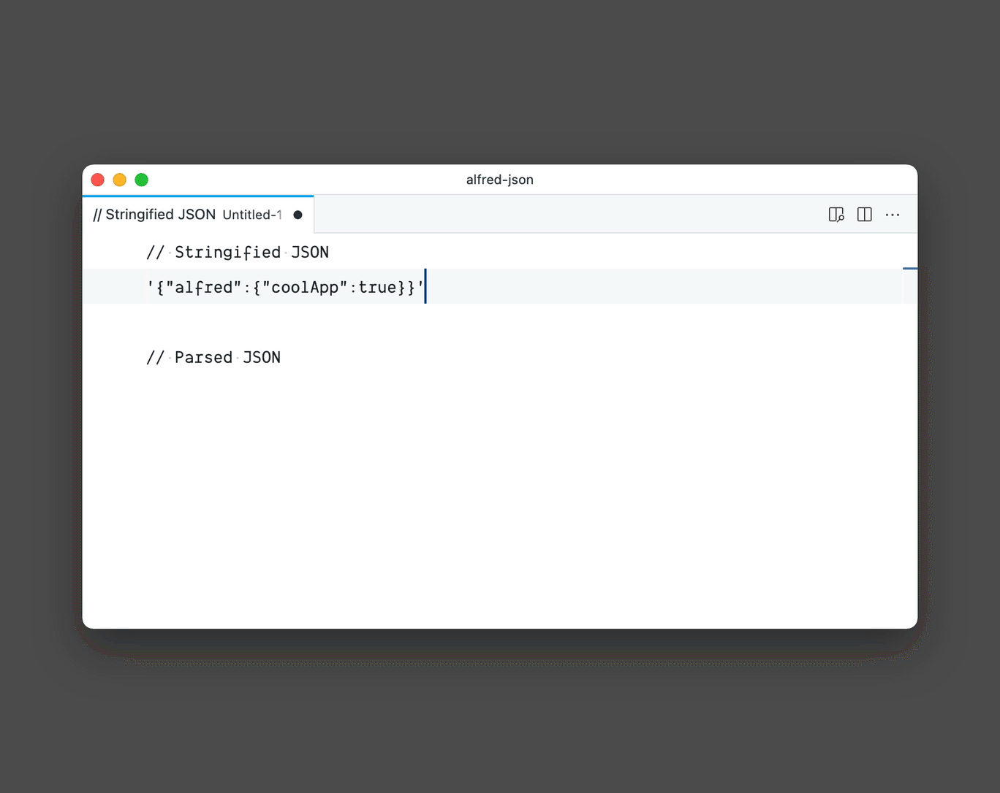
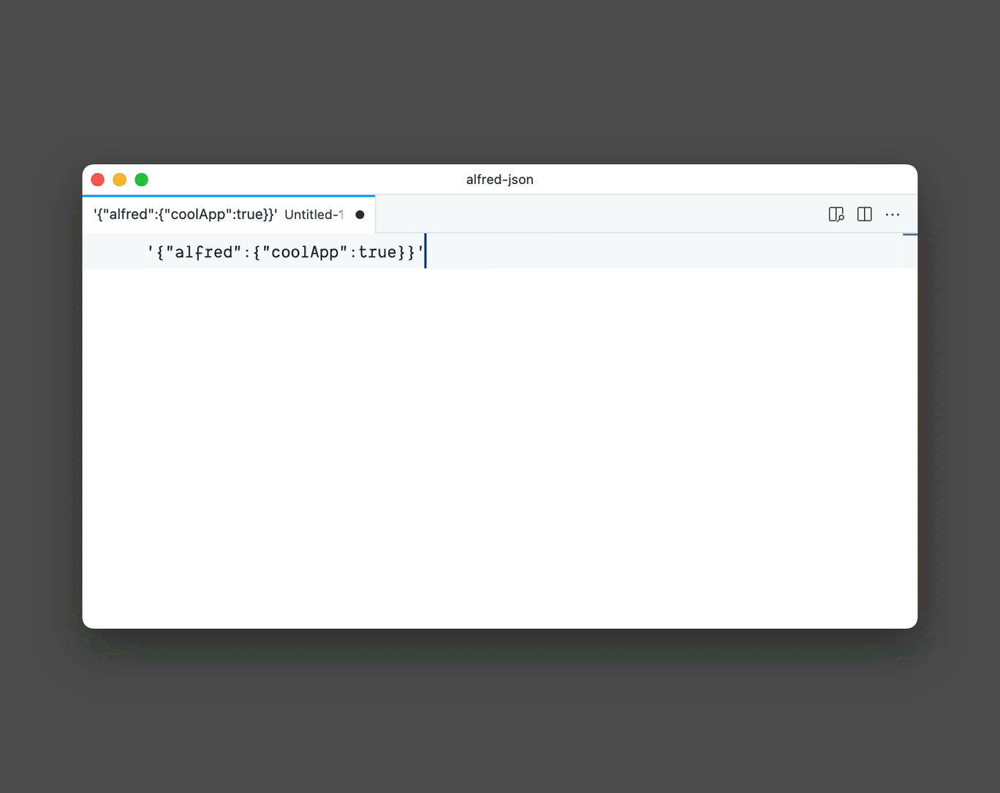

# Alfred JSON

Alfred workflow to parse and stringify JSON. It can be triggered by `json-parse`/`json-stringify` keyword or as a Universal Action.

## Use (triggered by keyword)

### json-parse

1. Use `json-parse` keyword and pass stringified JSON as an argument.
2. Hit Enter to trigger the workflow.
3. Parsed output will be copied to your clipboard.

### json-stringify

1. Use `json-stringify` keyword and pass parsed JSON as an argument.
2. Hit Enter to trigger the workflow.
3. Stringified output will be copied to your clipboard.
## Use (as a Universal Action)

### json-parse

1. Select stringified JSON.
2. Invoke Universal Action panel and choose `json-parse`.
3. Selection will be parsed.

### json-stringify

1. Select parsed JSON.
2. Invoke Universal Action panel and choose `json-stringify`.
3. Selection will be stringified.

